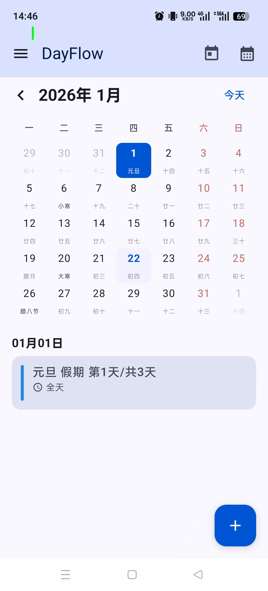
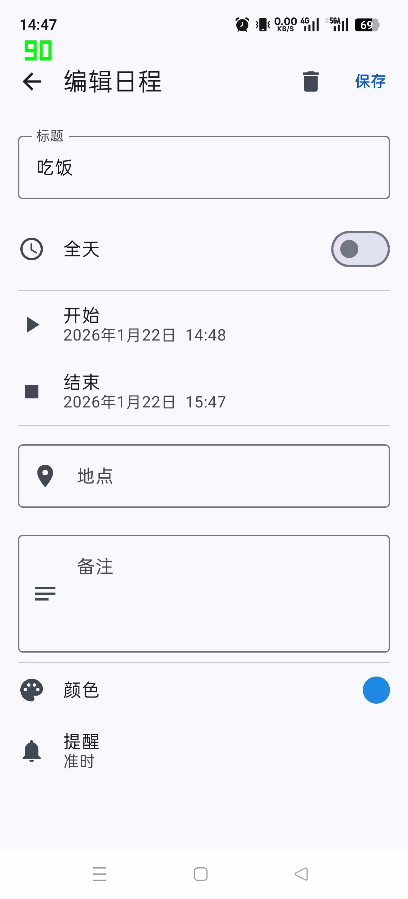
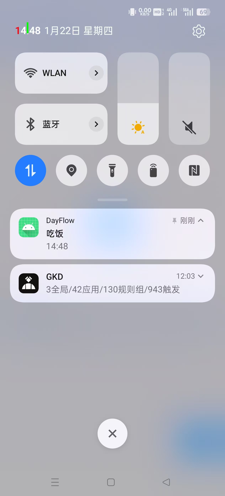
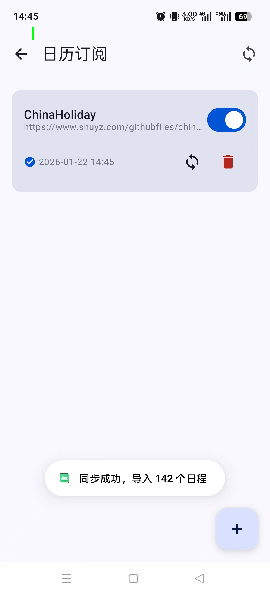

# DayFlow 日历应用 - 产品报告

## 一、产品功能介绍

### 1.1 产品概述

DayFlow 是一款功能完善的 Android 日历应用，采用现代化的 Material Design 3 设计语言，提供直观的日程管理体验。应用支持多种视图模式、农历显示、智能提醒、iCalendar 导入导出以及网络日历订阅等功能。

### 1.2 核心功能

#### 1.2.1 日历视图

- **月视图**：展示整月日程概览，支持农历显示
- **周视图**：按周展示日程安排
- **日视图**：详细展示单日日程
- **年视图**：年度日历总览


*图：月视图日历界面，显示农历、节日、日程列表*

#### 1.2.2 日程管理

- **创建日程**：支持设置标题、时间、地点、备注
- **全天事件**：支持全天事件标记
- **颜色标签**：多种颜色分类管理
- **智能提醒**：准时、提前5分钟至1周多种提醒选项


*图：日程编辑界面，支持完整的日程信息设置*

#### 1.2.3 提醒通知

- **精确提醒**：使用 AlarmManager 实现精确定时提醒
- **通知推送**：系统通知栏显示日程提醒
- **开机恢复**：设备重启后自动恢复所有提醒


*图：通知栏显示日程提醒*

#### 1.2.4 农历支持

- **农历日期**：每日显示对应农历日期
- **传统节日**：自动标注春节、中秋等传统节日
- **二十四节气**：显示节气信息
- **干支纪年**：支持天干地支、生肖显示

#### 1.2.5 数据导入导出

- **iCalendar 格式**：支持标准 .ics 文件导入导出
- **跨平台兼容**：可与 Google Calendar、Outlook 等互通

#### 1.2.6 网络日历订阅

- **URL 订阅**：通过 URL 订阅远程日历
- **自动同步**：支持手动和自动同步
- **订阅管理**：启用/禁用/删除订阅


*图：日历订阅界面，显示订阅管理和同步状态*

---

## 二、程序概要设计

### 2.1 技术选型

| 类别 | 技术方案 |
|------|----------|
| 开发语言 | Kotlin |
| UI 框架 | Jetpack Compose |
| 架构模式 | MVVM + Clean Architecture |
| 依赖注入 | Hilt |
| 数据库 | Room |
| 异步处理 | Kotlin Coroutines + Flow |
| 导航 | Navigation Compose |

### 2.2 模块划分

```
DayFlow/
├── app/                          # 应用模块
│   └── src/main/java/com/hsk/dayflow/
│       ├── app/                  # 应用入口
│       │   ├── DayFlowApplication.kt
│       │   └── navigation/       # 导航配置
│       ├── core/                 # 核心模块
│       │   ├── database/         # 数据库
│       │   ├── di/               # 依赖注入
│       │   ├── model/            # 数据模型
│       │   ├── notification/     # 通知提醒
│       │   ├── icalendar/        # iCalendar 解析
│       │   └── lunar/            # 农历计算
│       ├── feature/              # 功能模块
│       │   ├── calendar/         # 日历功能
│       │   ├── event/            # 日程管理
│       │   ├── settings/         # 设置
│       │   └── subscription/     # 订阅管理
│       └── MainActivity.kt
└── docs/                         # 文档
```

### 2.3 数据模型

#### 2.3.1 日程事件 (CalendarEvent)

```kotlin
data class CalendarEvent(
    val id: Long,
    val title: String,
    val description: String,
    val startTime: LocalDateTime,
    val endTime: LocalDateTime,
    val isAllDay: Boolean,
    val location: String,
    val color: EventColor,
    val reminder: ReminderType?,
    val recurrenceRule: String?,
    val subscriptionId: Long?
)
```

#### 2.3.2 订阅 (SubscriptionEntity)

```kotlin
data class SubscriptionEntity(
    val id: Long,
    val name: String,
    val url: String,
    val isEnabled: Boolean,
    val lastSyncTime: LocalDateTime?,
    val lastSyncStatus: String
)
```

---

## 三、软件架构图

### 3.1 整体架构

```
┌─────────────────────────────────────────────────────────────┐
│                      Presentation Layer                      │
│  ┌─────────────┐  ┌─────────────┐  ┌─────────────────────┐  │
│  │   Screens   │  │  ViewModels │  │    UI Components    │  │
│  │  (Compose)  │  │   (State)   │  │  (DayCell, etc.)    │  │
│  └─────────────┘  └─────────────┘  └─────────────────────┘  │
└─────────────────────────────────────────────────────────────┘
                              │
                              ▼
┌─────────────────────────────────────────────────────────────┐
│                       Domain Layer                           │
│  ┌─────────────────┐  ┌─────────────────────────────────┐   │
│  │   Repositories  │  │         Use Cases               │   │
│  │  (Interfaces)   │  │  (Business Logic)               │   │
│  └─────────────────┘  └─────────────────────────────────┘   │
└─────────────────────────────────────────────────────────────┘
                              │
                              ▼
┌─────────────────────────────────────────────────────────────┐
│                        Data Layer                            │
│  ┌──────────┐  ┌──────────┐  ┌──────────┐  ┌────────────┐  │
│  │   Room   │  │   DAOs   │  │ Entities │  │  Network   │  │
│  │ Database │  │          │  │          │  │  (HTTP)    │  │
│  └──────────┘  └──────────┘  └──────────┘  └────────────┘  │
└─────────────────────────────────────────────────────────────┘
```

### 3.2 数据流架构

```
┌──────────┐    ┌────────────┐    ┌────────────┐    ┌──────────┐
│   User   │───▶│   Screen   │───▶│  ViewModel │───▶│Repository│
│  Action  │    │ (Compose)  │    │  (State)   │    │  (Data)  │
└──────────┘    └────────────┘    └────────────┘    └──────────┘
                      ▲                                   │
                      │                                   ▼
                      │           ┌────────────┐    ┌──────────┐
                      └───────────│    Flow    │◀───│   Room   │
                                  │  (Observe) │    │ Database │
                                  └────────────┘    └──────────┘
```

### 3.3 通知系统架构

```
┌─────────────┐     ┌──────────────────┐     ┌─────────────────┐
│  保存日程   │────▶│ ReminderScheduler │────▶│   AlarmManager  │
└─────────────┘     └──────────────────┘     └─────────────────┘
                                                      │
                                                      ▼ (到时间)
┌─────────────┐     ┌──────────────────┐     ┌─────────────────┐
│  显示通知   │◀────│ NotificationHelper│◀────│ ReminderReceiver│
└─────────────┘     └──────────────────┘     └─────────────────┘
```

---

## 四、技术亮点及实现原理

### 4.1 农历算法

**实现原理**：基于寿星万年历算法，使用预计算的农历数据表（1900-2100年）进行公历到农历的转换。

```kotlin
// 农历数据表：每年用一个整数编码
// - 低4位：闰月月份
// - 第5位：闰月大小月
// - 第6-17位：1-12月大小月
private val LUNAR_INFO = intArrayOf(
    0x04bd8, 0x04ae0, 0x0a570, ...
)

fun solarToLunar(date: LocalDate): LunarDate {
    // 计算距离1900年1月31日的天数
    val offset = date.toEpochDay() - baseDate.toEpochDay()
    // 逐年、逐月减去天数，得到农历年月日
    ...
}
```

**特点**：
- 支持1900-2100年农历转换
- 自动识别传统节日和二十四节气
- 支持干支纪年和生肖

### 4.2 精确提醒机制

**实现原理**：使用 `AlarmManager.setExactAndAllowWhileIdle()` 设置精确闹钟，配合 `BroadcastReceiver` 接收闹钟事件。

```kotlin
alarmManager.setExactAndAllowWhileIdle(
    AlarmManager.RTC_WAKEUP,
    triggerAtMillis,
    pendingIntent
)
```

**特点**：
- 即使设备休眠也能准时触发
- 设备重启后自动恢复所有提醒
- 支持多种提前提醒时间

### 4.3 iCalendar 标准兼容

**实现原理**：遵循 RFC 5545 标准实现 .ics 文件的解析和生成。

```
BEGIN:VCALENDAR
VERSION:2.0
PRODID:-//DayFlow//CN
BEGIN:VEVENT
UID:event-123@dayflow
DTSTART:20260122T140000
DTEND:20260122T150000
SUMMARY:会议
END:VEVENT
END:VCALENDAR
```

**特点**：
- 完整支持 VEVENT 组件
- 支持 VALARM 提醒
- 可与主流日历应用互通

### 4.4 响应式数据流

**实现原理**：使用 Kotlin Flow 实现数据的响应式更新，UI 自动响应数据变化。

```kotlin
val monthEvents: StateFlow<List<CalendarEvent>> = _uiState
    .flatMapLatest { state ->
        eventRepository.getEventsForMonth(state.currentMonth)
    }
    .stateIn(viewModelScope, SharingStarted.WhileSubscribed(5000), emptyList())
```

**特点**：
- 数据变化自动更新 UI
- 避免内存泄漏
- 支持背压处理

---

## 五、总结

DayFlow 是一款功能完善、架构清晰的 Android 日历应用。采用现代化的技术栈和设计模式，实现了日程管理、农历支持、智能提醒、数据导入导出和网络订阅等核心功能。应用遵循 Material Design 3 设计规范，提供流畅的用户体验。

### 功能完成情况

| 功能模块 | 状态 |
|----------|------|
| 日历视图（月/周/日/年） | ✅ 完成 |
| 日程 CRUD | ✅ 完成 |
| 提醒通知 | ✅ 完成 |
| 农历支持 | ✅ 完成 |
| iCalendar 导入导出 | ✅ 完成 |
| 网络日历订阅 | ✅ 完成 |

---

*文档版本：1.0*
*更新日期：2026年1月22日*
